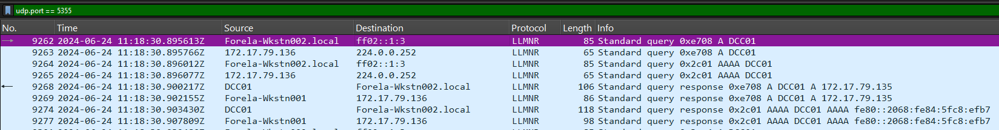
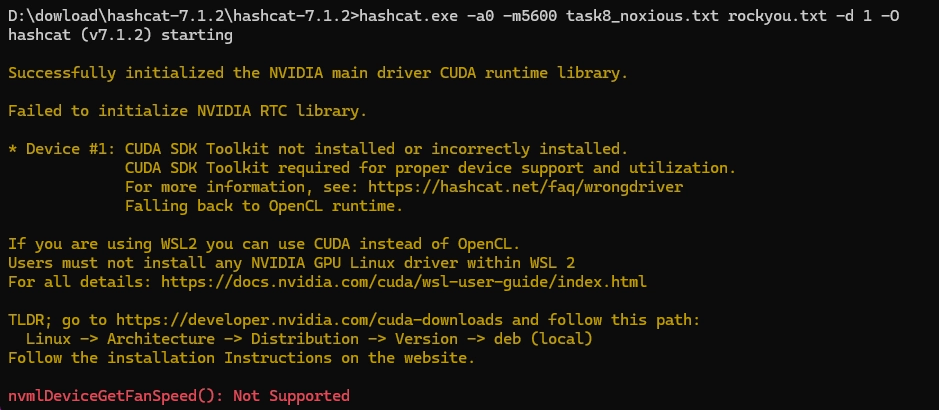

# Noxious

URL: https://app.hackthebox.com/sherlocks/Noxious?tab=play_sherlock

### Scenario

The IDS device alerted us to a possible rogue device in the internal Active Directory network. The Intrusion Detection System also indicated signs of LLMNR traffic, which is unusual. It is suspected that an LLMNR poisoning attack occurred. The LLMNR traffic was directed towards Forela-WKstn002, which has the IP address 172.17.79.136. A limited packet capture from the surrounding time is provided to you, our Network Forensics expert. Since this occurred in the Active Directory VLAN, it is suggested that we perform network threat hunting with the Active Directory attack vector in mind, specifically focusing on LLMNR poisoning.

- Giao thức là một giao thức mạng cho phép các máy tính trong cùng một mạng cục bộ (LAN) tìm thấy nhau bằng tên mà không cần đến máy chủ DNS.
- Khi DNS không phân giải được địa chỉ miền thì nó sẽ sử dụng giao thức LLMNR để phát một tín hiệu broadcast ra toàn bộ mạng LAN để hỏi địa chỉ IP của tên miền đó. Kẻ tấn công sẽ sử dụng công cụ Responder để luôn lắng nghe mạng, khi có tín hiệu broadcast như vậy thì nó sẽ giả mạo địa chỉ đó và nạn nhân gửi NTLM Hash cho kẻ tấn công.

### Task 1: Its suspected by the security team that there was a rogue device in Forela's internal network running responder tool to perform an LLMNR Poisoning attack. Please find the malicious IP Address of the machine.

- Lọc các gói tin theo port của giao thức LLMNR là `5355`
  
- Máy Forela-Wkstn002 đi hỏi toàn bộ mạng LAN với địa chỉ Multicast là `224.0.0.252` và `ff02::1:3` để xem máy nào có tên miền là DCC01
- Ta được biết máy thật trong mạng nội bộ này chỉ có `DC01` thôi, còn `DCC01` là do người dùng gõ sai chính tả.
- Ta thấy gói thứ 9268 đã có máy của attaker trả lời và giả mạo đó là máy DCC01 và trả lời IP của máy đó là `172.17.79.135`

⇒ Đáp án: `172.17.79.135`

### Task 2: What is the hostname of the rogue machine?

- Giao thức DHCP hoạt động theo 4 quy trình trong mạng:
  - Discover: client gửi broadcast để khám phá xem máy nào là DHCP server.
  - Offer: DHCP server phản hồi lại với các ip, subnetmask,.. dự kiến.
  - Request: gửi yêu cầu đồng ý lấy ip đó, bước này thường cung cấp các thông tin của client như hostname,…
  - Acknowledge: server xác nhận lại.
- Vậy muốn tìm hostname trong bước này thì ta cần lọc trong giao thức DHCP
  
- Vì ta đã biết ip của attacker là `127.17.79.135` nên tìm trong gói DHCP request
  

⇒ Đáp án: kali

### Task 3: Now we need to confirm whether the attacker captured the user's hash and it is crackable!! What is the username whose hash was captured?

- Khi nạn nhân gõ nhầm tên máy chủ thành `DCC01`, mục đích thực sự của họ thường là muốn truy cập vào một thư mục chia sẻ nội bộ qua đường dẫn dạng `\\DCC01\share`. Giao thức chịu trách nhiệm cho việc chia sẻ file trong Windows chính là SMB.
  
- Các gói tin trên là quá trình xác thực của giao thức NTLMSSP (NT LAN Manager Security Support Provider) là giao thức xác thực thách thức-phản hồi của Microsoft, dùng để bảo mật đăng nhập và truyền dữ liệu trong hệ thống Windows.
- Kẻ tấn công đã lừa máy nạn nhân tin rằng máy của hắn là một máy chủ chia sẻ file (SMB). Khi máy nạn nhân cố gắng kết nối, nó tự động gửi thông tin đăng nhập (mật khẩu đã băm) cho kẻ tấn công.
- Cuộc tấn công diễn ra theo chu kỳ "Hỏi - Đáp - Lừa đảo" như sau:
  - **Gói 9278 - 9280:** Máy nạn nhân và "máy chủ giả" thỏa thuận giao thức SMB2.
  - **Gói 9290-Negotiate:** Máy nạn nhân gửi yêu cầu thiết lập phiên làm việc.
  - **Gói 9291-Challenge:** Máy của kẻ tấn công gửi lại một mã Challenge. Thông báo `STATUS_MORE_PROCESSING_REQUIRED` là bình thường, nghĩa là "hãy gửi mật khẩu của bạn cho tôi để tôi kiểm tra".
  - **Gói 9292-Authenticate:**
    - Máy nạn nhân tin lời, gửi gói tin xác thực chứa **User: `FORELA\john.deacon`**.
    - Bên trong gói tin này chính là **NTLMv2 Hash** của người dùng John Deacon. Kẻ tấn công lúc này đã thu thập được mã băm này vào máy của hắn.
    - NTLMv2 Hash = hash( hash(password) + challenge value)
  - **Gói 9293:** Sau khi đã lấy được mã băm, kẻ tấn công trả về lỗi `STATUS_ACCESS_DENIED` (Từ chối truy cập) để máy nạn nhân tưởng rằng mình gõ sai mật khẩu hoặc máy chủ bị lỗi, nhằm tránh bị nghi ngờ.
  - Các gói tin sau đó bị lặp lại quy trình này nhiều lần vì máy của nạn nhân kiên trì, khi bị từ chối truy cập, nó sẽ gửi lại nhiều lần với hy vọng kết nối được.
  ⇒ Đáp án: `john.deacon`

Task 4: In NTLM traffic we can see that the victim credentials were relayed multiple times to the attacker's machine. When were the hashes captured the First time?

- Đáp án là thời gian của gói tin NTLM-AUTH đầu tiên kia

⇒ Đáp án: `2024-06-24 11:18:30`

### Task 5: What was the typo made by the victim when navigating to the file share that caused his credentials to be leaked?

⇒ Đáp án: DCC01

### Task 6: To get the actual credentials of the victim user we need to stitch together multiple values from the ntlm negotiation packets. What is the NTLM server challenge value?

- Mở nội dung gói tin 9291
- Mở rộng trường SMB2 (Server Message Block Protocol Version 2) -> Session Setup Response (0x1) -> Security Blob -> GSS-API Generic -> Simple Protected Negotiation -> negTokenTarg-> NTLM Secure Service Provider -> NTLM Server Challenge

⇒ Đáp án: `601019d191f054f1`

### Task 7: Now doing something similar find the NTProofStr value.

- Mở gói tin 9292
- Mở rộng SMB2 (Server Message Block Protocol
  Version 2) -> Session Setup Response (0x1) -> Security Blob -> GSS-API Generic -> Simple
  Protected Negotiation -> negTokenTarg -> NTLM Secure Service Provider -> -> NTLM Response -> NTLMv2 Response -> NTProofStr.

⇒ Đáp án: `c0cc803a6d9fb5a9082253a04dbd4cd4`

### Task 8: To test the password complexity, try recovering the password from the information found from packet capture. This is a crucial step as this way we can find whether the attacker was able to crack this and how quickly.

Hint: Create a new file and plug in the values as follows .
User::Domain:ServerChallenge:NTProofStr:NTLMv2Response(without first 16 bytes).
The NTLMv2 Response value can be found from where we found NTProofStr. Remove the first 16
bytes(32 characters) from the value. Then crack the hash using hashcat. Hashcat syntax will be as
following `hashcat.exe -a0 -m5600 hashfile.txt rockyouwordlist.txt`

- Ta sẽ sử dụng hashcast để bẻ khóa từ NTProofStr tìm được
- Đối với mã băm **NetNTLMv2** (Mã module của Hashcat là `5600`), định dạng chuẩn bắt buộc phải là: `Username::Domain:ServerChallenge:NTProofStr:ClientBlob`
- Phải xóa đi 32 ký tự đầu của NTLMv2Response thì mới ra ClientBlob
  ```powershell
  john.deacon::FORELA:601019d191f054f1:c0cc803a6d9fb5a9082253a04dbd4cd4:010100000000000080e4d59406c6da01cc3dcfc0de9b5f2600000000020008004e0042004600590001001e00570049004e002d00360036004100530035004c003100470052005700540004003400570049004e002d00360036004100530035004c00310047005200570054002e004e004200460059002e004c004f00430041004c00030014004e004200460059002e004c004f00430041004c00050014004e004200460059002e004c004f00430041004c000700080080e4d59406c6da0106000400020000000800300030000000000000000000000000200000eb2ecbc5200a40b89ad5831abf821f4f20a2c7f352283a35600377e1f294f1c90a001000000000000000000000000000000000000900140063006900660073002f00440043004300300031000000000000000000
  ```




⇒ Đáp án: `NotMyPassword0k?`

### Task 9: Just to get more context surrounding the incident, what is the actual file share that the victim was trying to navigate to?

- Lọc ra giao thức smb và ta sẽ tìm thấy gói tin Tree Connect Request và Tree Connect Response, đây là 2 gói tin yêu cầu và chấp thuận của SMB khi người dùng muốn truy cập vào file share.
- 2 gói tin này sẽ chứa đường dẫn đầy đủ của file share mà người dùng muốn truy cập vào.


⇒ Đáp án: `\\DC01\DC-Confidential`
